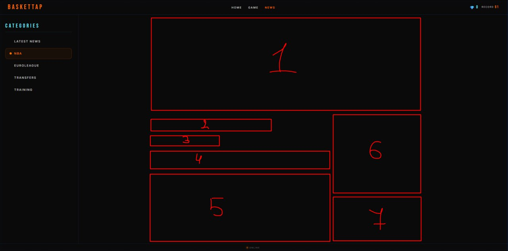

BEFORE CODDING READ revisions\spec.md AND DO EVERYTHING BASED ON IT 

1) Новини зламані якщо я клікаю на новину то я не можу гортати в низ + додай нормальні категорії в яких будуть новини

2) заміни всі мета теги на ці 
    <title>BasketTap — Free Basketball Tap &amp; Clicker Game</title>
<meta name="description" content="Tap the basketball, upgrade skills, earn diamonds and unlock auto-tappers. Free browser clicker game — no download needed!">
<meta name="keywords" content="basketball tap game, basketball clicker, free online basketball, browser game, idle clicker, tap game, no download game">
<meta name="author" content="Yura Fedoryshyn">
<link rel="canonical" href="https://basketball-portal-seven.vercel.app/">

<meta name="robots" content="index, follow">
<meta charset="UTF-8">
<meta name="viewport" content="width=device-width, initial-scale=1">
<meta name="theme-color" content="#ffffff" media="(prefers-color-scheme: light)">
<meta name="theme-color" content="#000000" media="(prefers-color-scheme: dark)">
ще + мені не подобається що коли в грі вилізає холд то комбо пропадає, виправє

3) прибери магазин за геми і ще додай таке що мяч в деяких місцях блистить і туди треба клікнути щоб набити комбо а інакше комбо не набивається, ще зроби престижі доступніші і зроби щоденні квести і чим вище у тебе престиж тим більше квестів у тебе що дня максимальний престиж це 10 і за квести дають діаманти

4) в src\pages\index.html я закинув лінк на фавіконки а в public самі фавіконки встав ії на всьому сайті а також перечитай revisions\spec.md і пофіксь все на сайті не згідне з ним і останнє додай в окремих новинах кнопку переслати якою можна буде поділитися новиною з кимось

5) 

6) дивись в майбутньому хочу перебудувати новини повністю тому зроби нову категорію яка називатиметься (test) і додай туди просто декілька пустих товин без тексту або фотки можеш просто lorem і пустий дів і зроби це все згідно з revisions\spec.md

7) добав це в тестову новину 1 Pistons’ Meteoric Rise: Cunningham’s Poise, Cleveland’s Shooting Frost, and Detroit’s Band of Redemption
Detroit’s Remarkable Rebuild Clicks into Place
The scope of the Detroit Pistons’ transformation is genuinely breathtaking when placed in historical context. It was the 2023-24 season when this franchise was an afterthought, stumbling through an 82-game schedule to secure a grand total of 14 wins. That level of futility usually consigns a team to years of obscurity. Yet here they stand on May 7, 2026, not merely participating in the postseason theater, but dominating it. With their second consecutive home victory over the Cleveland Cavaliers, they have planted their flag just two triumphs away from a berth in the Eastern Conference Finals.

The series scoreline of 2-0 does not fully illustrate the control Detroit exerted in Game 2. For the second straight contest, the Pistons exhibited a superior collective composure during high-pressure minutes. Their defensive rotations were sharper, the number of unforced errors was significantly lower, and their offensive execution down the stretch made Cleveland’s efforts look chaotic by comparison. The Cavaliers’ offensive philosophy is heavily reliant on the individual brilliance of James Harden and Donovan Mitchell. Through the first two games of this semifinal clash, those two central figures produced muted, ineffective performances, while Cleveland’s auxiliary pieces failed to pick up the slack.

The post-game demeanor of Cavs coach Kenny Atkinson betrayed a man searching for a schematic escape hatch. He openly admitted his confusion regarding his team’s sluggish starts and inability to maintain cohesion, promising a return to the strategic drawing board. However, the solutions feel elusive. Here is an in-depth analysis of the four critical elements that defined Detroit’s Game 2 victory.

The Unfazed Brilliance of Cade Cunningham
Command of the Critical Moments
To understand what Cade Cunningham did to Cleveland in this game, you must appreciate the art of pacing and temperament over sheer athletic explosion. He has earned a burgeoning reputation as the most level-headed star on the floor in tense situations. In a raucous fourth quarter where the Cavaliers were desperately attempting to flip the script, Cunningham completely hijacked the flow of the game. He dropped a dozen of his total 25 points during this final period, effectively neutralizing every counter-punch Cleveland attempted.

He is not a player who relies on superhuman verticality or blinding speed; his game is orchestrated from the ground. Despite a lack of elite explosive bounce, Cunningham possesses an uncanny ability to slither past on-ball defenders and carve out the necessary inches for a clean jumper. What distinguishes him as a burgeoning superstar extends far beyond the bucket tally. His leadership is non-verbal, communicated through his refusal to panic. He exhibits an intrinsic trust in his teammates’ spacing, displays exceptional instincts for passing lanes defensively, and never abandons the game plan. His statistical output—averaging 31 points on 55% shooting from distance along with over seven assists across his last five contests (all wins, three of which were elimination games)—is merely a reflection of a deeper competitive mettle. He is not just putting up numbers; he is engineering victories.

The Intangibles Behind the Production
The uniqueness of Cunningham lies in the fact that a standard box score cannot measure his true influence. He executes the "hidden" mechanics of basketball—decision-making under duress, spatial awareness in the half-court, and a palpable steadiness that radiates through the roster—with veteran precision. Regardless of whether his shot is falling early, or if a defensive rotation forces a difficult pass, his demeanor never shifts toward frustration. There is a total absence of flinching. In Game 2, this manifested as stifling defense to complement his fourth-quarter scoring burst. He is rarely caught out of position on switches, and his size prevents opponents from overpowering him on the drive. This two-way, high-IQ command turns him into a closer who controls the outcome without necessarily dominating the possession count.

The Reputation Weight Straining James Harden
A Persistent Pattern of Playoff Bleeding
If James Harden had refused the midseason move from the Clippers, his spring would have concluded without playoff basketball, leaving his legacy in a state of suspended ambiguity. By accepting the trade to Cleveland, he walked straight back into the type of pressurized spotlight that has so often singed his reputation. Regrettably for him and the Cavs, the playoff pattern is not merely repeating itself; it is intensifying. The former MVP, a lock for the Hall of Fame based on his revolutionary scoring and playmaking, continues to be haunted by chronic issues with ball security and inefficiency at the most critical times.

His statistical output in Game 2 was sobering. He converted just three field goals on 13 attempts, finishing with 10 points while handing the ball back to Detroit four times. Perhaps the most damning detail was his vanishing act in the second half, where a player of his shot-creation caliber managed to launch only two shots. This outing marked the fourth instance in the Cavaliers’ nine playoff games this season where Harden’s turnover count eclipsed the number of shots he successfully put through the net. It is a shocking metric for a primary ball-handler.

The Clock Ticking on a Finals Return
The historical backdrop makes this slump even more glaring. Harden hasn't navigated his way back to the NBA Finals since his role-player days in Oklahoma City over a decade ago. His journey through Houston, Brooklyn, Philadelphia, and the Clippers has consistently ended with a spring collapse rather than a coronation. Now at 36, the sight of him struggling to beat defenders off the bounce or settling for passive possessions signals a potential closing of his championship window. The Cavaliers are now in a 0-2 hole precisely because their offensive engine is malfunctioning. A narrative shift is still technically possible with a powerful Game 3 home performance, but the mountain of evidence suggests that Detroit’s length and discipline pose a riddle that this version of Harden simply cannot solve.

The Perimeter Ice Age That Froze Cleveland
A Catastrophic Long-Range Collapse
To describe the Cavaliers’ shooting in the final 12 minutes, one might imagine the sound of iron ringing out in a grim, repetitive chorus. The team put up 11 three-point attempts in the fourth quarter and missed every single one. In a league defined by spacing and the mathematics of the three-point line, generating a flat zero from distance in a closeout period is essentially forfeiting the game. These were empty trips that led directly to transition opportunities and high-percentage looks for the Pistons on the other end. Had Cleveland managed to hit at a merely average clip during that stretch, the final margin could have swung in their favor. Instead, the drought created an unbridgeable chasm.

The Star Duo’s Shooting Struggles
The infection of poor shooting started at the top of the food chain. Mitchell and Harden combined to shoot a dismal 2-for-13 from beyond the arc. For an offense predicated on these guards creating gravity, the inability to hit open looks allowed Detroit’s defense to pack the paint and clog passing lanes. The reliability of role players like Max Strus, who missed the bulk of his attempts, couldn't rescue them, especially with the sharpshooting Sam Merrill sidelined by a hamstring issue. It is bizarrely fortunate for Cleveland that the game remained competitive despite such a glaring offensive hemorrhage. The silver lining is that the law of averages tends to favor shooters on their home floor, but the Pistons have established a defensive tone that suggests these misses are not merely coincidental.

The Redemption Tour: Harris and Robinson Reborn
The Confounding Revival of "Castoffs"
In both South Florida and the city of brotherly love, basketball observers are squinting at their screens in bewilderment. The performances of Tobias Harris and Duncan Robinson in Detroit blues seem to belong to different players than the ones those fanbases remember discarding. Harris, who once closed his Philadelphia tenure with a zero-point playoff stinker over 29 minutes, is currently riding an unprecedented wave of seven consecutive 20-point postseason games. He is methodically brutalizing Cleveland’s defenders with a deliberate, floor-bound post game, carving out deep position and executing a turnaround jump shot that has become virtually unguardable.

Coach J.B. Bickerstaff articulated it perfectly by noting Harris possesses zero insecurity regarding his identity. He knows exactly where he is going on the floor—usually the left block—and he systematically gets to that spot regardless of the resistance. Simultaneously, Robinson has transformed back into the lethal floor-spacer that teams once feared during Miami’s Finals run. Logging 37 heavy minutes in Game 2, Robinson responded with 17 points, punishing Cleveland’s rotations with 10-for-17 three-point shooting in the series. The reliability and consistency of these two revamped veterans are providing the Pistons with a stable floor of production that the Cavaliers’ supporting cast simply cannot touch, leaving their former employers to wonder where this version of the players had been hiding. знайди і обріж фото для цієї новини самостійно